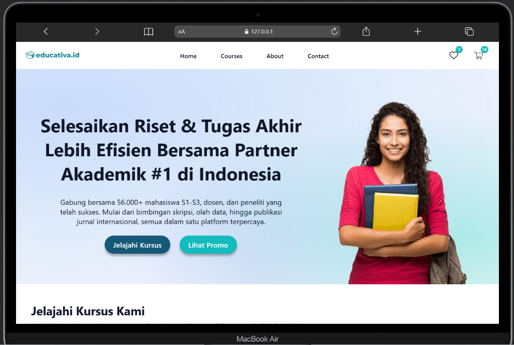
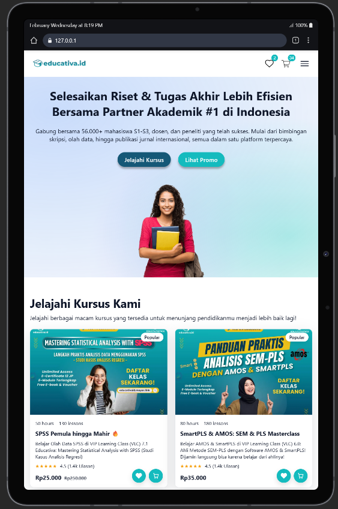
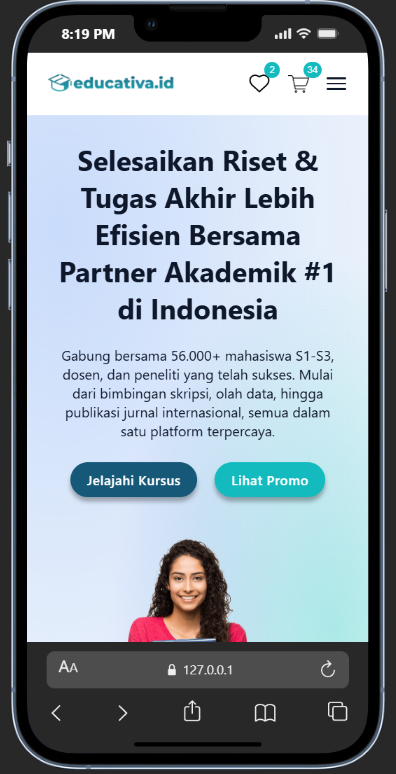

# Educativa LMS Landing Page

Sebuah Landing Page interaktif untuk platform **Learning Management System (LMS)** yang dirancang khusus untuk ekosistem **Educativa.id**. Proyek ini fokus pada desain responsif, interaksi dinamis, dan pengalaman pengguna yang modern bagi mahasiswa serta peneliti di Indonesia.

---

## Live Preview

> https://revanyangel.github.io/LMS-Educativa/

* **Desktop**

  

* **Tablet**

  

* **Mobile**

  

## Deskripsi Utama
Membangun antarmuka landing page yang menarik dan fungsional untuk mendukung kebutuhan akademik, mencakup:
* **Hero Section** yang informatif.
* **Product List** dalam format grid yang responsif.
* **Fitur Interaktif** pada Navbar dan kartu produk menggunakan JavaScript.

---

## Fitur Utama

### 1. Navbar (Navigasi & Tracking)
* **Logo & Menu:** Navigasi jelas yang mencakup Home, Courses, About, dan Contact.
* **Badge Counter Dinamis:** Icon Wishlist dan Cart dilengkapi dengan badge angka yang bertambah secara real-time saat user berinteraksi dengan produk.
* **Responsive Toggle:** Menu hamburger untuk tampilan mobile yang dioptimalkan.

### 2. Hero Section
* **Headline & Subheadline:** Pesan utama yang menonjolkan Educativa sebagai partner akademik #1 di Indonesia.
* **Double CTA Button:** Tombol "Jelajahi Kursus" dan "Lihat Promo" untuk memudahkan navigasi user.
* **Visual Modern:** Desain latar belakang menggunakan gradien radial yang estetik.

### 3. Product List (Grid Layout)
* **Render Dinamis:** Daftar kursus dihasilkan secara otomatis dari data JavaScript (Array of Objects).
* **Informasi Lengkap:** Setiap kartu menampilkan gambar, durasi, jumlah materi, rating, serta perbandingan harga asli dan diskon.
* **Efek Hover:** Animasi kartu yang terangkat (*lift-up*), bayangan yang menebal, dan efek zoom pada gambar saat di-hover.

### 4. Interaksi JavaScript & UX
* **Fly-to-Cart Animation:** Feedback visual berupa ikon yang "terbang" dari kartu menuju navbar saat tombol diklik.
* **Persistence State:** Menggunakan `localStorage` untuk menyimpan data wishlist dan cart sehingga tidak hilang saat halaman di-refresh.
* **Modal Promo Popup:** Muncul secara otomatis setelah halaman dimuat untuk menawarkan promosi khusus.
* **Aksesibilitas Modal:** Dapat ditutup melalui tombol (X), klik pada overlay, maupun menekan tombol `Esc` pada keyboard.

---

## Teknologi yang Digunakan
* **HTML5:** Struktur semantik untuk web yang standar.
* **CSS3:** Layouting menggunakan Flexbox & Grid, CSS Variables, dan animasi transisi.
* **Vanilla JavaScript (ES6+):** Manipulasi DOM, Event Handling, dan State Management sederhana.